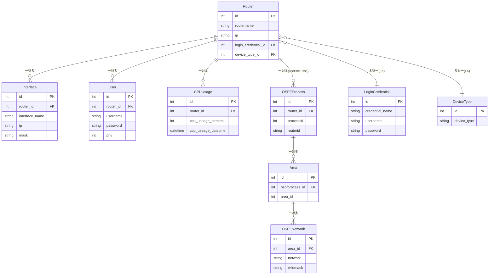

# 路由器配置数据库关系图

```mermaid
erDiagram
    Router ||--o{ Interface : "一对多"
    Router ||--o{ User : "一对多"
    Router ||--o{ CPUUsage : "一对多"
    Router ||--o{ OSPFProcess : "一对多(uselist=False)"
    Router }o--|| LoginCredential : "多对一(FK)"
    Router }o--|| DeviceType : "多对一(FK)"
    OSPFProcess ||--o{ Area : "一对多"
    Area ||--o{ OSPFNetwork : "一对多"

    Router {
        int id PK
        string routername
        string ip
        int login_credential_id FK
        int device_type_id FK
    }
    
    DeviceType {
        int id PK
        string device_type
    }
    
    LoginCredential {
        int id PK
        string credential_name
        string username
        string password
    }
    
    User {
        int id PK
        int router_id FK
        string username
        string password
        int priv
    }
    
    Interface {
        int id PK
        int router_id FK
        string interface_name
        string ip
        string mask
    }
    
    CPUUsage {
        int id PK
        int router_id FK
        int cpu_useage_percent
        datetime cpu_useage_datetime
    }
    
    OSPFProcess {
        int id PK
        int router_id FK
        int processid
        string routerid
    }
    
    Area {
        int id PK
        int ospfprocess_id FK
        int area_id
    }
    
    OSPFNetwork {
        int id PK
        int area_id FK
        string network
        string wildmask
    }
```
